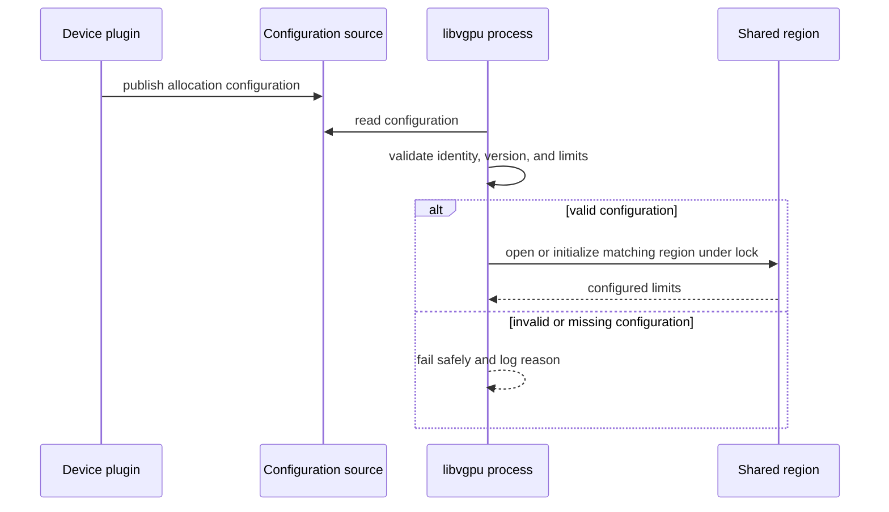

# GPU Memory Isolation for Child and SSH-Started Processes

**Status:** Proposal

**Target:** HAMi scheduler, NVIDIA device plugin, and HAMi-core (`libvgpu`)

**Related issue:** [Project-HAMi/HAMi#2125](https://github.com/Project-HAMi/HAMi/issues/2125)

**Related reports:** [#1112](https://github.com/Project-HAMi/HAMi/issues/1112), [#1090](https://github.com/Project-HAMi/HAMi/issues/1090)

## Abstract

HAMi currently gives the original container process GPU-limit configuration through environment variables. A child process, SSH shell, login shell, or clean-environment process may not receive the same values. It can then use different shared memory-limit state from the original process.

This design introduces a clear runtime-configuration model for `libvgpu`. It separates the source of configuration, shared-region state, and GPU-limit enforcement. The final source of configuration is not selected by this document. The first work is to reproduce the current behavior on a supported HAMi release with a real NVIDIA GPU, then choose the maintainer-approved source and lifecycle.


The first implementation must be narrow. It must keep existing behavior unchanged when the new design is disabled or unavailable, unless maintainers approve a clear migration path.

## Problem

HAMi uses a scheduler allocation, a device-plugin `Allocate()` response, and `libvgpu` shared state to enforce NVIDIA GPU limits inside a container.

Today, the device plugin sets values such as:

```text
CUDA_DEVICE_MEMORY_LIMIT_0=4096m
CUDA_DEVICE_SM_LIMIT=50
CUDA_DEVICE_MEMORY_SHARED_CACHE=<HAMi vGPU path>/<random>.cache
```

`libvgpu` reads `CUDA_DEVICE_MEMORY_SHARED_CACHE` to find the shared region. If the value is missing, it uses `/tmp/cudevshr.cache`. It also reads GPU memory limits from environment variables. A missing limit becomes `0` in the current initialization path.

The original process normally has these variables. A new SSH or login process may not:

```text
Original process                         New SSH/login process
----------------                         ---------------------
memory limit: 4096                       memory limit: missing
cache path: random cache file            cache path: missing
result: correct shared region            result: default/different region
```

The new process can create or use state that does not match the original process. This is the split-ledger problem.

The design must also avoid a wrong assumption: aggregate process count or one fixed cache path does not prove that the correct configuration exists. A process that starts first without valid configuration must not create an unlimited shared region.

## Goals

1. Make runtime GPU-limit configuration available to supported processes that do not inherit the original environment.
2. Give `libvgpu` one documented source of truth for limit, device mapping, and allocation identity.
3. Keep shared limit state separate for separate containers.
4. Make configuration validation happen before authoritative shared state is created.
5. Keep normal scheduler allocation and device-plugin behavior unchanged where possible.
6. Give clear errors for missing, invalid, unreadable, or mismatched configuration.
7. Test original, supported child-process, clean-environment, and SSH/new-shell behavior on real NVIDIA GPU hardware.
8. Keep the runtime path bounded and avoid scanning unrelated processes or container state for every CUDA call.

## Non-goals

This first design does not:

- claim a complete container-security boundary beyond HAMi, NVIDIA drivers, and the container runtime;
- replace the scheduler allocation protocol or GPU scheduling policy;
- add new GPU sharing modes, MIG policy, vGPU policy, or cross-node behavior;
- select a configuration file, `/proc/1/environ`, or fixed path before reproduction and maintainer review;
- guarantee unsupported SSH images, process launch methods, or user permission models;
- replace existing shared-region locking, versioning, and memory accounting without a clear reason.

Kubernetes does not guarantee that every process in a container receives the original process environment. This design therefore guarantees a configuration-discovery path for agreed supported cases; it does not promise arbitrary process injection or a security boundary outside HAMi's control.

## Existing HAMi Building Blocks

| Component | Existing responsibility | Role in this design |
| --- | --- | --- |
| Scheduler allocation annotation | Records selected devices for Pod containers. | Remains the scheduler-to-device-plugin allocation handoff. |
| NVIDIA device plugin `Allocate()` | Reads allocation data, sets environment values, and prepares mounts. | Prepares the approved configuration source and per-container state lifecycle. |
| `libvgpu` | Reads environment configuration, creates the shared region, and applies CUDA interception. | Reads and validates the approved source before opening or creating the region. |
| Shared memory-limit region | Stores initialized limits and process state under locking. | Remains the per-container enforcement state after configuration is validated. |
| Container runtime | Starts processes and applies mounts. | Provides the mount/process behavior used by the approved source. |

The design builds on the current scheduler → device-plugin → `libvgpu` flow. It does not create a second allocation path.

## Proposed Architecture


The architecture has three separate concerns:

```text
Configuration facts:  allocation identity, device mapping, memory/SM limits, version
Shared state:          initialized region, process accounting, synchronization state
Runtime enforcement:   libvgpu CUDA interception and memory-limit behavior
```

Configuration facts must come from the approved source. Shared state is not the source of allocation truth; it is the runtime state used after configuration validation.

### Runtime configuration source boundary

The runtime component that owns container allocation must publish the facts needed by `libvgpu`. The first design review must decide whether this is a device-plugin-created artifact, a safe container-init recovery source, or another mechanism.

The source boundary has these rules:

- workload users must not be able to forge an allocation identity or higher GPU limit;
- the source must be available to the supported processes that load `libvgpu`;
- a process-local environment may remain a compatibility input, but cannot be the only authoritative source for recovery cases;
- the source must be versioned and validated before use;
- an invalid update must not partially change live configuration.

### Canonical runtime configuration model

The implementation needs a source-neutral model. The exact storage format is deferred, but the required facts are:

```go
type RuntimeGPUConfig struct {
    Version            string
    AllocationID       string
    ContainerID        string
    Devices            []RuntimeGPUDevice
    SharedRegionRef    string
}

type RuntimeGPUDevice struct {
    DeviceID           string
    MemoryLimitMB      uint64
    SMLimitPercent     uint32
}
```

`AllocationID` identifies one allocation lifecycle. `ContainerID` identifies the container that may use the configuration. `SharedRegionRef` identifies one per-container region, not a global file. The real field names, encoding, maximum sizes, and backward-compatibility rules require maintainer review.

### Configuration validation

Before `libvgpu` creates a region, it validates:

1. supported configuration version;
2. non-empty allocation and container identity;
3. valid device mapping and positive configured memory limits where a limit is required;
4. a per-container region reference that matches the allocation identity;
5. source ownership and access rules required by the selected mechanism.

If validation fails, `libvgpu` must not silently create a new default region with an unlimited limit.

### Shared-region and process lifecycle

`libvgpu` keeps the existing shared-region role: it stores the initialized limits and coordinates processes. The region is opened only after valid configuration is available.



Later supported processes follow the same read, validate, and open path. A process that starts before the original application must get the same result: valid configuration and a correct region, or a safe failure.

## Lifecycle and Recovery

### Allocation lifecycle

1. The scheduler records the selected allocation in the existing Pod allocation data.
2. The NVIDIA device plugin resolves allocation data during `Allocate()`.
3. The device plugin prepares the approved configuration source and per-container state location.
4. The container starts and processes load `libvgpu`.
5. `libvgpu` validates configuration and opens or initializes the matching region.

### Restart and cleanup

The selected design must define behavior for:

- container exit and Pod deletion;
- Pod recreation with a different UID;
- device-plugin restart;
- stale configuration or shared region after abnormal termination;
- multiple containers in one Pod with separate GPU allocations;
- configuration source update while an old region still exists.

Configuration or region cleanup must not release state for a live allocation. Stale state must not be reused by a new allocation only because the path or container name matches.

## Failure and Retry Semantics

| Failure point | Required behavior | Shared-region result |
| --- | --- | --- |
| Configuration source not ready | Supported process waits/retries only if the approved source defines a bounded readiness path; otherwise it fails safely. | No new region. |
| Configuration missing, malformed, or unsupported | Log a stable error and reject initialization. | No new unlimited region. |
| Configuration identity and region identity disagree | Reject the state or use a maintainer-approved recovery action. | Existing region is not trusted. |
| Permission denied | Log source/permission class without secrets. | No fallback to unrelated global state. |
| Concurrent process start | Revalidate under existing or improved lock. | One validated region or no region. |
| Device plugin or process restart | Reconcile configuration identity and current allocation before reuse. | Stale state is not silently adopted. |

An isolation-configuration error is different from a normal CUDA allocation failure. Logs and metrics should keep these classes separate so operators can diagnose environment, mount, permission, region, and driver problems.

## Performance and Observability

The startup path should use a small, bounded configuration read and one matching region lookup. It must not scan all processes in the container, all Pods on the Node, or all global cache files for every CUDA call.

Useful observability includes:

- configuration source result: ready, missing, invalid, permission denied, mismatch;
- configuration version and allocation/container identity in safe redacted form;
- shared-region open, initialization, lock, and mismatch result;
- number of recovery attempts and safe failures;
- real GPU validation environment and test scenario in PR documentation.

Logs must not print secrets or full untrusted payloads.

## Compatibility and Security

- Existing scheduler allocation annotations remain the scheduler-to-device-plugin contract.
- Existing environment variables may remain for old workloads only if the approved compatibility design is safe.
- The device plugin remains responsible for runtime configuration delivery; `libvgpu` remains responsible for in-container validation and enforcement state.
- The design must work for supported container users and permission models; it must not assume that every user can read another process's `/proc` environment.
- Only trusted runtime components may publish authoritative allocation configuration. Workload users must not be able to increase their own limits by editing runtime state.
- This design improves resource-management configuration consistency. It does not claim to make the container a complete security sandbox.

## Implementation Map

The exact file list depends on the approved approach. The expected areas are:

| Area | Likely HAMi locations | Responsibility |
| --- | --- | --- |
| Allocation preparation | `pkg/device-plugin/nvidiadevice/nvinternal/plugin/` | Produce configuration from existing allocation data and prepare lifecycle/mount behavior. |
| Runtime configuration reader | `libvgpu/src/` | Read, validate, version, and report configuration. |
| Shared-region discovery | `libvgpu/src/multiprocess/` | Open the matching per-container region only after validation. |
| CUDA limit path | `libvgpu/src/cuda/` | Use the validated shared-region limit for memory behavior. |
| Tests | HAMi Go tests, HAMi-core tests, and real GPU integration scripts | Cover parsing, lifecycle, supported process cases, and regressions. |
| Documentation | `docs/` and user/operator material | Explain configuration, migration, failures, and troubleshooting. |

The first implementation should not change scheduler policy, unrelated vendors, or unrelated `libvgpu` behavior.

## Alpha Scope Boundary

| Area | First delivery | Deferred work |
| --- | --- | --- |
| Hardware | One or more supported NVIDIA GPU environments with documented driver/runtime versions. | Broad vendor or hardware-matrix coverage. |
| Processes | Original process, agreed child-process cases, `env -i`, SSH/login shell, and SSH-first case. | Unsupported shells, arbitrary privilege changes, and unknown process managers. |
| Configuration | One maintainer-approved source and lifecycle. | Multiple competing sources and automatic migration of every legacy image. |
| State | Per-container region discovery and validation. | Replacing all shared-region accounting internals. |
| Enforcement | Existing `libvgpu` memory-limit behavior with real GPU tests. | New GPU sharing policy or new scheduler policy. |

This boundary prevents the first change from claiming more coverage than it can test and support.

## Rollout and Implementation Phases

The feature should be introduced in small reviewable phases.

| Phase | Deliverable |
| --- | --- |
| 1 | Reproducible current-hardware report: exact environment, commands, logs, region evidence, and GPU result. |
| 2 | Short threat-model and compatibility decision: source ownership, permissions, lifecycle, and supported process cases. |
| 3 | Maintainer-approved configuration source and `libvgpu` validation/discovery implementation with unit tests. |
| 4 | Device-plugin lifecycle/mount work, shared-region error handling, and compatibility tests. |
| 5 | Real NVIDIA GPU regression tests, user/operator documentation, review fixes, and rollout guidance. |

The final rollout mechanism—feature gate, configuration version, compatibility fallback, or migration period—must be selected with maintainers. It must not silently enable an unsafe fallback for existing workloads.

## Validation Plan

### Current behavior reproduction

Before implementation, record:

- HAMi and HAMi-core revision;
- Kubernetes version, container runtime, NVIDIA driver, GPU model, and host OS;
- Pod manifest and requested GPU-memory limit;
- commands for original process, supported child process, `env -i`, SSH/new shell, and SSH-first case;
- `nvidia-smi` output, CUDA allocation result, HAMi/libvgpu logs, and shared-region/configuration evidence.

### Tests after implementation

| Test | Required result |
| --- | --- |
| Original process | Uses the configured GPU limit. |
| Supported child process | Uses the configured limit, or has a documented supported boundary. |
| Environment-scrubbed process | Finds approved configuration or fails safely. |
| SSH/new-shell process | Finds approved configuration or fails safely. |
| SSH-first process | Cannot create an unlimited region only because its environment is missing. |
| Invalid or unreadable configuration | Fails safely with useful logs. |
| Region/configuration mismatch | Is rejected or follows an approved recovery rule. |
| Two containers on one GPU | Do not collide or overwrite each other’s state. |
| Restart and cleanup | Do not reuse stale state for a different live allocation. |

Unit tests must cover parsing, versions, identity checks, path handling, and failure behavior. Integration tests must cover the agreed process cases. Changes affecting in-container isolation must be validated on real GPU hardware before a HAMi PR, as required by [CONTRIBUTING.md](https://github.com/Project-HAMi/HAMi/blob/master/CONTRIBUTING.md).

## Open Questions for Review

1. Which child-process, SSH, and login-shell scenarios are officially supported by HAMi?
2. Which runtime configuration source is correct for supported images and runtimes?
3. Is a device-plugin-controlled mount acceptable, and what ownership and permission model should it use?
4. Can `/proc/1/environ` be a supported recovery source, and under which checks?
5. What is the safe behavior when no trusted configuration is available?
6. How should old environment-only workloads migrate?
7. What cleanup and restart reconciliation is required for configuration and shared-region state?

## References

- [LFX issue #2125](https://github.com/Project-HAMi/HAMi/issues/2125)
- [HAMi issue #1112](https://github.com/Project-HAMi/HAMi/issues/1112)
- [HAMi issue #1090](https://github.com/Project-HAMi/HAMi/issues/1090)
- [NVIDIA device plugin Allocate path](https://github.com/Project-HAMi/HAMi/blob/dcd120acd19824a73ffe5cb7c3413b5750126b1e/pkg/device-plugin/nvidiadevice/nvinternal/plugin/server.go#L824-L878)
- [HAMi-core shared-region initialization](https://github.com/Project-HAMi/HAMi-core/blob/a26e57e0061efed98d32310a8a7986935dc9098e/src/multiprocess/multiprocess_memory_limit.c#L1079-L1147)
- [HAMi-core zero-limit memory-info path](https://github.com/Project-HAMi/HAMi-core/blob/a26e57e0061efed98d32310a8a7986935dc9098e/src/cuda/memory.c#L503-L515)
- [HAMi architecture design](https://github.com/Project-HAMi/HAMi/blob/master/docs/develop/design.md)
- [HAMi init-container design](https://github.com/Project-HAMi/HAMi/blob/master/docs/develop/initContainer-design.md)
